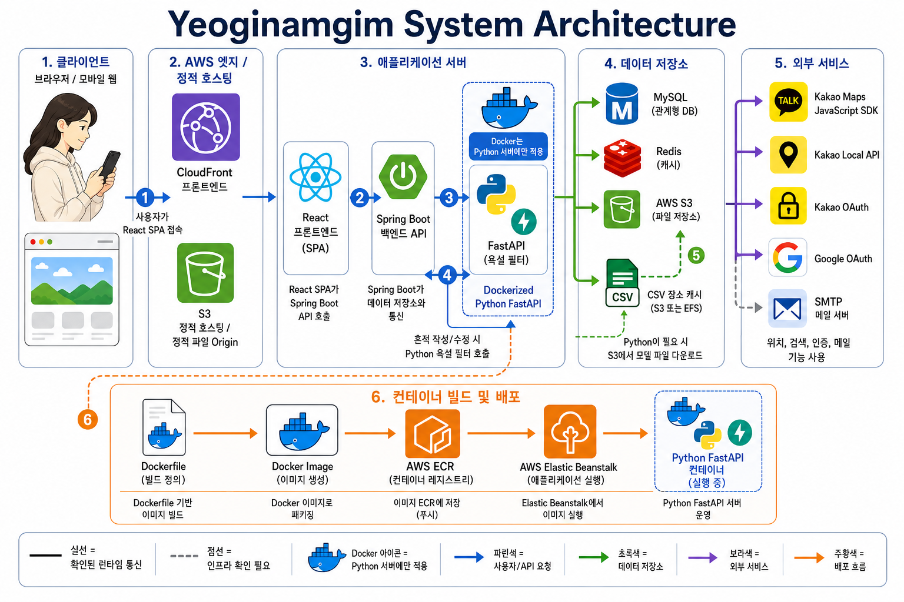

## 1. 프로젝트 소개

### 1.1 프로젝트 이름: 여기남김

> **실제 장소와 사용자의 기억을 연결하는 위치 기반 기록 서비스**

“여기남김”은 사용자가 특정 장소나 보드에 자신의 기억과 경험을 남긴다는 의미를 담고 있습니다.  

### 1.2 서비스 개요

여기남김은 실제 장소와 사용자의 기록을 연결하는 위치 기반 기록 서비스입니다.

사용자는 카카오맵 기반으로 주변 장소를 탐색하고, 특정 장소의 보드에 포스트잇, 이미지, 텍스트 형태의 흔적을 남길 수 있습니다. 남겨진 흔적은 같은 장소를 방문한 다른 사용자들과 공유되며, 사용자는 추천, 신고, 보관함 기능을 통해 기록을 관리할 수 있습니다.

또한 사용자가 직접 커스텀 보드를 생성하고 초대 링크를 통해 다른 사용자를 참여시킬 수 있어, 장소 기반 기록뿐만 아니라 여행, 모임, 행사와 같은 그룹 단위의 기록도 함께 관리할 수 있습니다.

### 1.3 기획 의도 및 배경

- **사회적 측면**: 기존 리뷰 서비스는 장소를 별점이나 후기 중심으로 평가하는 경우가 많아, 사용자가 공간에서 느낀 감정이나 순간적인 경험을 자유롭게 남기기 어렵습니다. 여기남김은 장소를 평가의 대상이 아닌 기억과 경험이 쌓이는 공간으로 바라보고, 여러 사용자의 기록이 한곳에 모일 수 있도록 기획했습니다.

- **사용자 경험 측면**: SNS는 개인 피드 중심으로 기록이 쌓이기 때문에 특정 장소에 대한 여러 사용자의 기록을 한곳에서 확인하기 어렵고, 시간이 지나면 기록이 흩어지는 한계가 있습니다. 여기남김은 기록의 중심을 개인 피드가 아닌 **장소**와 **보드**로 설정하여, 같은 공간을 경험한 사용자들의 흔적을 함께 확인할 수 있도록 했습니다.

- **서비스 확장 측면**: 특정 장소에 기록을 남기는 기능을 넘어, 사용자가 직접 커스텀 보드를 만들고 초대 링크로 다른 사용자를 참여시킬 수 있도록 했습니다. 이를 통해 여행, 모임, 행사처럼 장소 기반 기록뿐만 아니라 그룹 단위의 추억도 함께 관리할 수 있는 서비스로 확장했습니다.

## 2. 팀 구성 및 역할

<table cellspacing="0" cellpadding="12">
  <tr>
    <td align="center" width="33%" bgcolor="#1F4E79">
      <strong>김용성</strong>
    </td>
    <td align="center" width="33%" bgcolor="#1F4E79">
      <strong>강병모</strong>
    </td>
    <td align="center" width="33%" bgcolor="#1F4E79">
      <strong>이태형</strong>
    </td>
  </tr>
  <tr>
    <td align="center">
      <strong>팀장 / 백엔드</strong>
    </td>
    <td align="center">
      <strong>Git 병합 / 파이썬</strong>
    </td>
    <td align="center">
      <strong>배포 / 백엔드</strong>
    </td>
  </tr>
  <tr>
    <td valign="top">
      <ul>
        <li>서비스 주요 화면 프론트엔드 구현</li>
        <li>커스텀 보드 DB 설계 및 CRUD 구현</li>
        <li>기획 및 일정 관리</li>
      </ul>
    </td>
    <td valign="top">
      <ul>
        <li>욕설 필터 기능 구현 및 배포</li>
        <li>사용자 정보 관리 기능 구현</li>
        <li>Redis 활용 이메일 인증</li>
      </ul>
    </td>
    <td valign="top">
      <ul>
        <li>AWS 배포 인프라</li>
        <li>UI 구성 및 사용자 흐름</li>
        <li>팔로우, 알림, 신고, 추천</li>
      </ul>
    </td>
  </tr>
  <tr>
    <td align="center">
      <a href="https://github.com/ys06o">GitHub</a>
    </td>
    <td align="center">
      <a href="https://github.com/kbm1611">GitHub</a>
    </td>
    <td align="center">
      <a href="https://github.com/lth0330">GitHub</a>
    </td>
  </tr>
</table>

## 3. 기술 스택

### 프론트엔드

### 백엔드

### 욕설 필터링

### 데이터베이스 / 저장소

### 외부 API

### 배포 / 인프라

## 4. 서비스 아키텍처

본 서비스는 사용자가 웹 또는 모바일 환경에서 React 기반 클라이언트에 접속하면, AWS CloudFront와 S3 정적 호스팅을 통해 프론트엔드 화면을 제공하는 구조입니다.  
클라이언트는 Spring Boot 백엔드 API와 통신하며, 필요한 경우 FastAPI 기반 Python 서버를 호출하여 욕설 필터링 기능을 수행합니다.

데이터는 MySQL, Redis, AWS S3를 통해 관리되며, 지도, 검색, 로그인, 메일 기능은 Kakao 및 Google OAuth, Kakao Local API, Kakao Maps SDK, SMTP 서버와 연동하여 처리합니다.  
Python FastAPI 서버는 Docker 이미지로 빌드된 후 AWS ECR에 저장되고, AWS Elastic Beanstalk를 통해 컨테이너 환경에서 실행됩니다.

## 5. 시연영상 링크

- [시연영상 보러가기](https://www.youtube.com/watch?v=tKTGVVTD5zw)

## 6. 참고 링크

- [프로젝트 배포 링크](https://d3vvhygufn2oi5.cloudfront.net/splash)
- [백엔드 깃허브 링크](https://github.com/kbm1611/Yeoginamgim-Back)
- [파이썬 깃허브 링크](https://github.com/kbm1611/Yeoginamgim-Python)
- [API 문서 / 참고 자료](https://docs.google.com/spreadsheets/d/1JPG2olfW4FKcZR7B_yKi8_nwn-M5Zn7T_9ogwQE2qAI/edit?gid=678243450#gid=678243450)
- [PPT 링크](https://canva.link/p8bahrbzjqnzgro)
- [피그마 링크](https://www.figma.com/design/PyZlUiPCcvxLt8mgNn91FM/%EC%A0%9C%EB%AA%A9-%EC%97%86%EC%9D%8C?t=HEMUU0J3LAuI08KZ-1)
